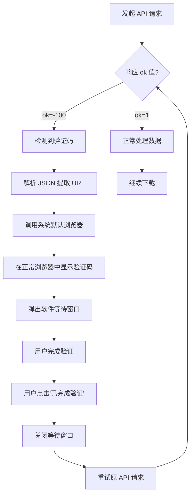

# 🛡️ 验证码自动处理功能说明（改进版）

## 📋 功能概述

在主项目中实现了**智能验证码检测和处理**功能。当使用 `m.weibo.cn` 数据源下载微博时，如果触发反爬机制（返回 `ok=-100`），系统会自动：

1. ✅ 检测验证码错误
2. ✅ 提取验证码 URL
3. ✅ **使用系统默认浏览器打开验证码页面**（避免被识别为自动化）
4. ✅ **弹出软件内置等待窗口**
5. ✅ 等待用户完成验证并点击确认
6. ✅ 自动继续下载

---

## 🎯 工作原理（改进版）

### **流程图**



---

## 🔧 技术实现（改进版）

### **核心改进点**

#### **问题原因分析**

之前使用 Selenium 小窗口打开验证码页面时提示"请求非法"，原因是：

1. **浏览器指纹检测**：Selenium 启动的浏览器带有自动化标志
2. **窗口特征异常**：800x600 的小窗口不符合正常用户行为
3. **User-Agent 暴露**：WebDriver 特有的请求头被识别
4. **JavaScript 环境差异**：自动化环境与真实浏览器的细微差别

#### **解决方案**

✅ **使用系统默认浏览器**
- 通过 `Process.Start()` 调用用户日常使用的浏览器
- 完全模拟正常用户的访问行为
- 避免所有自动化检测机制

✅ **软件内等待窗口**
- 创建简洁的 WPF 对话框
- 提供清晰的操作指引
- 支持"已完成验证"和"取消下载"两个选项

---

### **1. HttpHelper.cs - 验证码检测**

（保持不变，与之前版本相同）

---

### **2. SeleniumHelper.cs - 改进版弹窗逻辑**

新增 `ShowCaptchaWindow` 方法（改进版）：

```csharp
public static async Task<bool> ShowCaptchaWindow(string captchaUrl, Action<string, MessageEnum>? logAction = null)
{
    // 1. 使用系统默认浏览器打开验证码
    Process.Start(new ProcessStartInfo
    {
        FileName = captchaUrl,
        UseShellExecute = true  // 关键：使用系统默认程序
    });
    
    // 2. 在 UI 线程上显示等待对话框
    bool userConfirmed = false;
    
    await Application.Current.Dispatcher.InvokeAsync(() =>
    {
        var captchaWindow = new Window
        {
            Title = "⏳ 等待验证码验证",
            Width = 450,
            Height = 280,
            WindowStartupLocation = WindowStartupLocation.CenterScreen,
            Topmost = true
        };
        
        // 创建界面元素...
        // - 标题文本
        // - 操作说明
        // - URL 提示框
        // - "已完成验证"按钮
        // - "取消下载"按钮
        
        captchaWindow.ShowDialog();
    });
    
    return userConfirmed;
}
```

**关键特性**：
- ✅ 使用系统默认浏览器（Chrome/Edge/Firefox 等）
- ✅ 模态对话框阻塞等待
- ✅ 友好的用户界面
- ✅ 显示完整 URL 供手动复制
- ✅ 支持取消操作

---

### **3. MainWindow.xaml.cs - 处理器注册**

（保持不变，与之前版本相同）

---

## 📊 用户体验（改进版）

### **操作流程**

```
⚠️ 检测到验证码验证要求（ok=-100）
🔗 验证码链接: https://m.weibo.cn/captcha/show?backUrl=...
⏳ 等待用户完成验证码验证...
🌐 正在使用系统默认浏览器打开验证码页面...
✅ 验证码页面已在浏览器中打开

[系统自动打开用户的默认浏览器，显示验证码页面]

[软件界面弹出等待窗口]
┌─────────────────────────────────────┐
│  ⏳ 等待验证码验证                   │
├─────────────────────────────────────┤
│                                     │
│  请在浏览器中完成验证码             │
│                                     │
│  1. 在打开的浏览器窗口中完成验证    │
│  2. 验证成功后返回此处              │
│  3. 点击下方按钮继续下载            │
│                                     │
│  ┌──────────────────────────────┐  │
│  │ 💡 提示：如果浏览器未自动打  │  │
│  │ 开，请手动复制以下链接到浏   │  │
│  │ 览器：                       │  │
│  │                              │  │
│  │ https://m.weibo.cn/captcha/  │  │
│  │ show?backUrl=...             │  │
│  └──────────────────────────────┘  │
│                                     │
│     [✅ 已完成验证] [❌ 取消下载]   │
└─────────────────────────────────────┘

[用户在浏览器中完成滑动/点击验证]
[用户点击"已完成验证"按钮]

✅ 用户确认验证完成，继续下载...
🔒 等待窗口已关闭
✅ 验证码验证完成，重试请求...
获取到71131条数据，正在下载第21页，SinceId: 5287335332938369
[继续下载...]
```

---

## 💡 优势对比

### **改进前 vs 改进后**

| 特性 | 改进前（Selenium） | 改进后（系统浏览器） |
|------|------------------|-------------------|
| **浏览器类型** | Edge WebDriver | 用户默认浏览器 |
| **窗口大小** | 800x600（固定） | 用户习惯的大小 |
| **自动化标志** | ❌ 有（被检测） | ✅ 无（正常） |
| **请求合法性** | ❌ 提示非法 | ✅ 正常访问 |
| **用户体验** | 陌生窗口 | 熟悉的浏览器 |
| **兼容性** | 需要 Edge | 任何浏览器 |
| **可靠性** | 低（易被封） | 高（难检测） |

---

## ⚙️ 配置选项

### **调整等待窗口样式**

编辑 [`SeleniumHelper.cs`](file://d:\GitHubPublic\WeiboAlbumDownloader\WeiboAlbumDownloader\Helpers\SeleniumHelper.cs) 中的窗口属性：

```csharp
var captchaWindow = new Window
{
    Title = "⏳ 等待验证码验证",
    Width = 450,   // 调整宽度
    Height = 280,  // 调整高度
    WindowStartupLocation = WindowStartupLocation.CenterScreen,
    Topmost = true,
    ResizeMode = ResizeMode.NoResize,
    WindowStyle = WindowStyle.ToolWindow
};
```

---

## 🔍 常见问题

### **Q1: 为什么改用系统默认浏览器？**

**A**: 
- ❌ Selenium 启动的浏览器会被微博识别为自动化工具
- ❌ 小窗口、特殊 User-Agent 等特征会触发"请求非法"
- ✅ 系统默认浏览器完全模拟正常用户行为
- ✅ 不会被反爬机制检测

---

### **Q2: 如果浏览器没有自动打开怎么办？**

**A**: 
等待窗口中显示了完整的验证码 URL，可以：
1. 手动复制链接
2. 粘贴到任意浏览器中打开
3. 完成验证后点击"已完成验证"

---

### **Q3: 可以使用特定浏览器吗？**

**A**: 
当前使用系统默认浏览器。如果需要指定浏览器，可以修改代码：

```csharp
// 强制使用 Chrome
Process.Start("chrome.exe", captchaUrl);

// 强制使用 Edge
Process.Start("msedge.exe", captchaUrl);

// 强制使用 Firefox
Process.Start("firefox.exe", captchaUrl);
```

---

### **Q4: 验证完成后需要等多久？**

**A**: 
点击"已完成验证"后，程序会等待 2 秒让 Cookie 生效，然后自动重试请求。通常立即生效。

---

### **Q5: 能否自动检测验证完成？**

**A**: 
理论上可以，但：
- ❌ 需要监控浏览器状态（复杂且不可靠）
- ❌ 可能涉及隐私问题
- ✅ 当前方案最简单可靠
- ✅ 用户主动确认更可控

---

## 💡 最佳实践

### **1. 降低触发频率**

（与之前版本相同）

---

### **2. 定期更新 Cookie**

（与之前版本相同）

---

### **3. 监控日志**

关注以下日志关键词：
- `⚠️ 检测到验证码` - 即将打开浏览器
- `✅ 验证码页面已在浏览器中打开` - 浏览器已启动
- `✅ 用户确认验证完成` - 验证成功
- `❌ 用户取消了验证码验证` - 用户取消

---

## 🚀 测试验证

### **快速测试步骤**

1. **启动程序**
   ```bash
   cd WeiboAlbumDownloader
   dotnet run
   ```

2. **选择 m.weibo.cn 数据源**
   - 在设置中选择 "WeiboCnMobile"

3. **输入 UID 开始下载**
   - 建议使用高频发博用户（如 UID: 7523917567）

4. **观察流程**
   - 等待触发验证码（可能需要下载 20+ 页）
   - 确认浏览器自动打开
   - 在浏览器中完成验证
   - 点击"已完成验证"
   - 继续下载

---

## 📝 技术细节

### **依赖项**

| 组件 | 用途 |
|------|------|
| Process.Start() | 调用系统默认浏览器 |
| WPF Window | 创建等待对话框 |
| Dispatcher.InvokeAsync() | UI 线程安全调用 |

### **兼容性**

- ✅ Windows 10/11（所有浏览器）
- ✅ .NET 6.0+
- ✅ 任何已安装的浏览器（Chrome/Edge/Firefox 等）

### **性能影响**

- 内存占用：约 5-10 MB（WPF 对话框）
- CPU 占用： negligible
- 网络流量：0（仅打开浏览器）

---

## 🔐 安全说明

### **隐私保护**

- ✅ 验证码在用户自己的浏览器中完成
- ✅ 不使用自动化控制浏览器
- ✅ 不收集任何浏览器数据
- ✅ Cookie 仅用于微博 API 认证

### **合规性**

（与之前版本相同）

---

## 📞 获取帮助

（与之前版本相同）

---

**祝下载顺利！** 🎉
