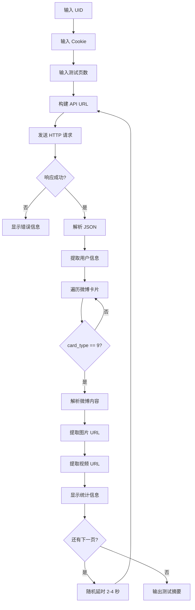

# 📦 测试脚本项目说明

## 🎯 项目目标

将主项目中 **m.weibo.cn 数据源**的核心逻辑抽离出来，创建一个独立的测试脚本，用于：
- ✅ 快速验证 API 接口是否正常
- ✅ 调试 Cookie 有效性
- ✅ 学习微博 API 数据结构
- ✅ 测试反爬机制和频率限制
- ✅ 为主项目开发提供参考

---

## 📂 文件结构

```
test/
├── TestWeiboMobileApi.csproj      # 项目配置文件 (.NET 6.0)
├── Program.cs                      # 主程序入口 (11KB)
├── run.bat                         # Windows 快速启动脚本
├── .gitignore                      # Git 忽略配置
│
├── Models/
│   └── WeiboCnMobileModel.cs      # 数据模型类 (简化版)
│
├── Helpers/
│   └── HttpHelper.cs              # HTTP 请求辅助类
│
├── README.md                       # 详细使用文档
├── QUICKSTART.md                   # 5分钟快速上手指南
└── PROJECT_SUMMARY.md             # 本文档
```

---

## 🔑 核心功能对比

### 与主项目的关系

| 功能 | 测试脚本 | 主项目 (MainWindow.xaml.cs) |
|------|---------|---------------------------|
| **API 调用** | ✅ 完整实现 | ✅ 完整实现 |
| **JSON 解析** | ✅ 完整实现 | ✅ 完整实现 |
| **用户信息获取** | ✅ 显示到控制台 | ✅ 显示到 UI + 下载头像 |
| **微博内容解析** | ✅ 文本、图片、视频 | ✅ 文本、图片、视频、LivePhoto |
| **文件下载** | ❌ 仅显示 URL | ✅ 实际下载文件 |
| **文件存在性检查** | ❌ 不涉及 | ✅ File.Exists() 验证 |
| **文件时间戳修改** | ❌ 不涉及 | ✅ SetFileTime() |
| **定时任务** | ❌ 不涉及 | ✅ Crontab 支持 |
| **消息推送** | ❌ 不涉及 | ✅ PushPlus 集成 |
| **UI 界面** | ❌ 控制台 | ✅ WPF 图形界面 |
| **多用户批量下载** | ❌ 单用户 | ✅ uidList.txt 批量处理 |
| **断点续传** | ❌ 不涉及 | ✅ 跳过已存在文件 |

---

## 🛠️ 技术栈

### 依赖包
- **.NET 6.0**: 运行时框架
- **Newtonsoft.Json 13.0.4**: JSON 序列化/反序列化

### 核心类
1. **HttpHelper**: 封装 HTTP GET 请求
   - 自动处理 GZip 压缩
   - 智能错误检测（验证码、频率限制）
   - 设置必要的请求头（Referer、User-Agent、Cookie）

2. **WeiboCnMobileModel**: 数据模型
   - 映射 m.weibo.cn API 返回的 JSON 结构
   - 包含 Card、Mblog、User、PageInfo 等嵌套类

3. **Program**: 主程序逻辑
   - 分页获取微博数据
   - 解析图片、视频 URL
   - 统计和展示结果

---

## 🚀 使用方法

### 方式一：批处理文件（最简单）
```bash
双击 test/run.bat
```

### 方式二：命令行
```bash
cd test
dotnet restore    # 恢复依赖
dotnet build      # 编译项目
dotnet run        # 运行测试
```

### 方式三：Visual Studio
1. 用 VS 打开 `TestWeiboMobileApi.csproj`
2. 按 F5 直接运行

---

## 📊 测试流程



---

## 💡 关键代码片段

### 1. API URL 构建
```csharp
string url = $"https://m.weibo.cn/api/container/getIndex?type=uid&value={userId}&containerid=107603{userId}&since_id={sinceId}&page={page}";
```

### 2. HTTP 请求
```csharp
var response = await HttpHelper.GetAsync<WeiboCnMobileModel>(url, cookie);
```

### 3. 图片 URL 生成
```csharp
foreach (var picId in card.Mblog.PicIds)
{
    string imageUrl = $"https://wx4.sinaimg.cn/large/{Path.GetFileName(picId)}.jpg";
}
```

### 4. 视频 URL 提取（优先级从高到低）
```csharp
if (!string.IsNullOrEmpty(urls.Mp48kMp4)) videoUrls.Add(urls.Mp48kMp4);
else if (!string.IsNullOrEmpty(urls.Mp44kMp4)) videoUrls.Add(urls.Mp44kMp4);
// ... 依次降级
```

### 5. 智能错误检测
```csharp
if (responseBody.Contains("captcha") || responseBody.Contains("-100"))
{
    Console.WriteLine("⚠️  检测到验证码验证！");
    // 给出详细解决方案
}
```

---

## ⚙️ 配置选项

### 修改默认参数

在 `Program.cs` 中：

```csharp
// 第 43 行：默认测试页数
int maxPages = 3;  // 改为想要的页数

// 第 178 行：延时范围（毫秒）
int delay = rd.Next(2000, 4000);  // 建议 2000-10000
```

### 添加自定义过滤

例如：只下载带图片的微博

```csharp
// 在 foreach 循环中添加
if (card.Mblog?.PicIds == null || !card.Mblog.PicIds.Any())
    continue;  // 跳过无图片的微博
```

---

## 🔍 调试技巧

### 1. 查看原始 JSON 响应

在 `HttpHelper.cs` 第 58 行后添加：
```csharp
Console.WriteLine($"[DEBUG] Response Body:\n{responseBody}");
```

### 2. 保存测试结果到文件

```bash
dotnet run > result.txt 2>&1
```

### 3. 单步调试

在 Visual Studio 中：
1. 在关键代码行设置断点
2. 按 F5 启动调试
3. 观察变量值变化

### 4. 网络抓包

使用 Fiddler 或 Charles：
1. 启动抓包工具
2. 运行测试脚本
3. 分析 HTTP 请求和响应

---

## 📈 性能优化建议

### 1. 并发请求（高级）
```csharp
// 不推荐：可能触发反爬
var tasks = pages.Select(page => FetchPageAsync(page));
await Task.WhenAll(tasks);
```

### 2. 缓存机制
```csharp
// 缓存已处理的 since_id，避免重复请求
HashSet<long> processedSinceIds = new HashSet<long>();
```

### 3. 增量更新
```csharp
// 记录上次成功的 since_id，下次从该位置继续
File.WriteAllText("last_since_id.txt", sinceId.ToString());
```

---

## 🎓 学习资源

### 推荐阅读顺序
1. **QUICKSTART.md** - 5 分钟快速上手
2. **README.md** - 详细使用说明
3. **Program.cs** - 理解核心逻辑
4. **WeiboCnMobileModel.cs** - 了解数据结构
5. **MainWindow.xaml.cs** - 对比主项目实现

### 相关文档
- [微博移动端 API 文档](https://m.weibo.cn/)
- [Newtonsoft.Json 官方文档](https://www.newtonsoft.com/json)
- [.NET HttpClient 文档](https://docs.microsoft.com/en-us/dotnet/api/system.net.http.httpclient)

---

## ⚠️ 注意事项

### 1. Cookie 安全
- ❌ **不要**将 Cookie 提交到 Git
- ❌ **不要**在公共场合分享 Cookie
- ✅ **定期**更新 Cookie（每 1-2 天）
- ✅ **保存**多个备用 Cookie

### 2. 反爬机制
- ✅ 使用随机延时（2-10 秒）
- ✅ 控制每日请求总量（< 100 页）
- ✅ 避免同一 IP 高频访问
- ❌ 不要多线程并发请求

### 3. 法律合规
- ⚖️ 使用者需自行研究当地法律法规
- ⚖️ 仅用于个人学习和研究
- ⚖️ 不得用于商业用途
- ⚖️ 作者不承担二次开发责任

---

## 🐛 已知问题

1. **部分视频无法下载**
   - 原因：微博设置了权限
   - 状态：暂时无法解决

2. **超过 9 张图片需要额外请求**
   - 原因：API 只返回前 9 张图的 ID
   - 解决：调用 `WeiboMidHelper.GetImageIdsByMidAsync()`

3. **转发微博被跳过**
   - 原因：代码中 `card.Mblog.RetweetedStatus != null` 判断
   - 如需下载，可移除该条件

---

## 🔄 版本历史

### v1.0 (2026-04-21)
- ✅ 初始版本发布
- ✅ 实现基本的 API 调用和数据解析
- ✅ 添加智能错误检测
- ✅ 编写完整文档

---

## 📞 反馈与支持

如有问题或建议：
1. 📖 查看 [README.md](README.md) 和 [QUICKSTART.md](QUICKSTART.md)
2. 🔧 参考 [故障排除指南](../TestScript/故障排除指南.md)
3. 💬 提交 GitHub Issue
4. 📧 联系项目维护者

---

## 📄 许可证

本项目遵循主项目的许可证协议。

---

**祝测试顺利！** 🎉
